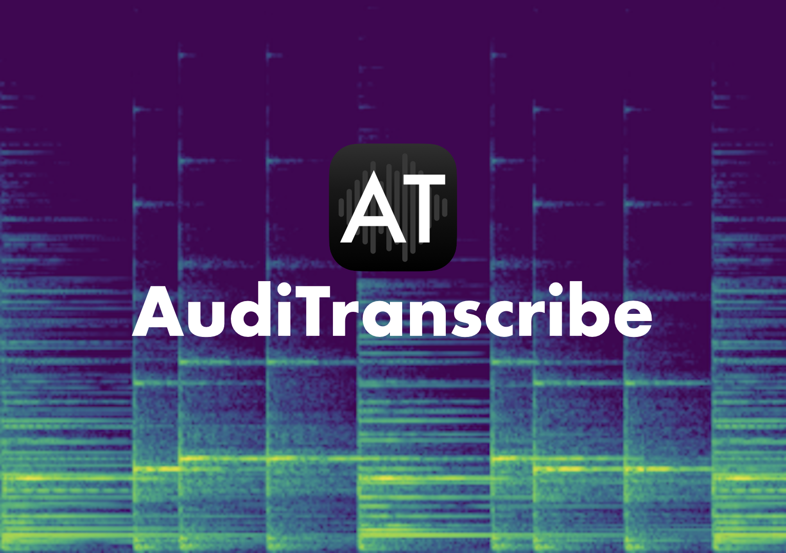

[](https://github.com/AudiTranscribe/AudiTranscribe/releases/latest)
[](https://github.com/AudiTranscribe/AudiTranscribe/blob/main/LICENSE)
[](https://app.fossa.com/projects/custom%2B32213%2Fgithub.com%2FAudiTranscribe%2FAudiTranscribe?ref=badge_shield)
[](https://codecov.io/gh/AudiTranscribe/AudiTranscribe)
[](.github/CODE_OF_CONDUCT.md)

An open-source music transcription application.

# Features

AudiTranscribe was built to assist you in transcribing music pieces.

- Convert supported audio files into spectrograms for easier transcription.
- Play notes alongside the music piece to get a "feel" of what notes are being played by clicking on the appropriate row
  on the spectrogram.
- Get a sense of how the notes are arranged in the song.

# Why make AudiTranscribe?

Transcribing music by ear is hard. Tiny details in music pieces may be left out when transcribing by ear, and it takes
practice to properly transcribe notes from a song. AudiTranscribe was created to ease this process and allow the average
person to find out the notes of their favourite songs.

Also, professional music transcription services cost *a lot*, especially if you plan to use the transcription service
a few times over a year. In that case, the cost of these services (which range from $40 to $120) are not worth it.
AudiTranscribe is meant to be an Open-Source and free alternative.

# Dependencies

The only dependency needed is [FFmpeg](https://ffmpeg.org/): a complete, cross-platform solution to record, convert and
stream audio and video. AudiTranscribe uses it to help process different audio files.

**Note**:

- For Windows and macOS, AudiTranscribe will attempt to automatically install FFmpeg. You do **not** need to manually
  install FFmpeg unless specified.
- For Linux and others, **manual installation of FFmpeg is required**.

## For Developers

If you are planning to develop for AudiTranscribe, please ensure that **Java 17** is installed on your machine.

In addition, there are some additional dependencies to install for specific platforms:

- **Windows**: The [**WiX Toolset 3**](https://wixtoolset.org/) is needed to generate the AudiTranscribe executable for
  Windows.
- **macOS**: On macOS, the **Xcode Command Line Tools** needs to be installed to make AudiTranscribe run in development.
  You can install the XCode Command Line Tools by running:
  ```
  xcode-select --install
  ```
  in a terminal.
- **Linux**: The following instructions are most relevant to **Ubuntu**. However, other Linux platforms may follow these
  requirements as well:
    - The **`bin-utils`** package needs to be installed on your machine in order to access the `objcopy` command from
      the shell. Install it by running:
      ```
      sudo apt-get install binutils
      ```
    - The **`fakeroot`** package needs to be installed in order to properly generate the Linux package. Install it by
      running:
        ```
      sudo apt-get install fakeroot
      ```
    - Please ensure that `jlink` is properly installed on your machine by running:
      ```
      jlink --version
      ```
      If an error appears, please install `jlink` by running:
      ```
      sudo apt install openjdk-17-jdk-headless
      ```
      or a similar command on your Linux machine.

# Installation

This section will guide you through the installation of AudiTranscribe.

## Using An Installer

### Windows

1. Head to the latest releases section.
    - If there are no current releases, you may want to choose a pre-release version instead.
2. Under the downloads section, download the Windows installer.
3. Unzip the installer package. The package should contain one `.exe` file.
4. Run the application.
    - It is highly likely that an alert like "Windows protected your PC" would pop up. This is normal, and is due to
      AudiTranscribe not being a recognized app yet.
    - If you see such an alert, click on "More Info", and then click on "Run Anyway" at the bottom of the screen.
5. Follow the installation instructions.
6. The application should be installed once completed.

### macOS

1. Head to the latest releases section.
    - If there are no current releases, you may want to choose a pre-release version instead.
2. Under the downloads section, download the macOS file.
3. Unzip the installer package. The package should contain one `.dmg` file. **Do not open the `.dmg` file yet**.
4. If you were to open the `.dmg` file now, it would likely be quarantined by Apple due to it lacking a proper signing
   key. To fix this, open Terminal and run the following command. The command will remove all attributes from the `.dmg`
   file and makes it no longer quarantined. (**Note**: You may be prompted to enter your password.)
   ```bash
   sudo xattr -cr path/to/the/dmg/file
   ```
5. Once the command is run, open the `.dmg` file.
6. Drag `AudiTranscribe.app` into the Applications folder.
7. Run the application!

### Linux

These instructions are most applicable to users on **Ubuntu**, or any Linux system that is running on `amd64`
with `.deb` installation capabilities.

1. Head to the latest releases section.
    - If there are no current releases, you may want to choose a pre-release version instead.
2. Under the downloads section, download the Linux file.
3. Unzip the installer package. The package should contain one `.deb` file.
4. Open the `.deb` file using the "Software Install" application.
5. Click "Install" on the window that appears.
6. Wait for the application to fully install. Then, close the installer window.
    - Make sure you [read the licence information](https://auditranscribe.app/licences) for AudiTranscribe.
7. Run the application!

## From Source

This guide will assume that [Apache Maven](https://maven.apache.org/) and [FFmpeg](https://ffmpeg.org/) are installed.

Download the latest release/pre-release from the "releases" section of the GitHub page, or download the latest files
under the `staging` branch.

To set up AudiTranscribe with maven, run the following commands:

```bash
# Install custom dependencies from the "lib" directory
mvn validate

# Install the rest of the dependencies from the maven repository
mvn -B clean:clean compiler:compile javafx:jlink

# Test installation
mvn test
```

# Security Policy

Read AudiTranscribe's security policy at [SECURITY.md](.github/SECURITY.md).

# Contributing to AudiTranscribe

Please read the [CONTRIBUTING.md](.github/CONTRIBUTING.md) file.

# Licences

Full licence information, including dependencies' licences, can be found [here](https://auditranscribe.app/licences).

This project is licensed under the [GNU General Public Licence V3](LICENSE).

[](https://app.fossa.com/projects/custom%2B32213%2Fgithub.com%2FAudiTranscribe%2FAudiTranscribe?ref=badge_large)
