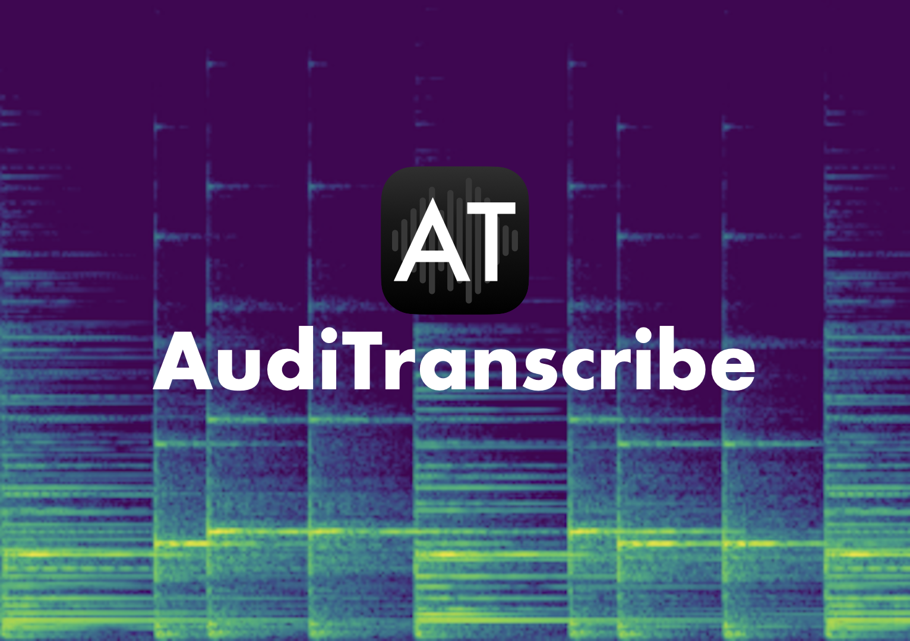

An open source music transcription application.

# Features
AudiTranscribe was built to assist you in transcribing music pieces.
- Convert supported audio files into annotated spectrograms for easier transcription.
- Play notes alongside the music piece to get a "feel" of what notes are being played.
- Get a sense of how the notes are arranged in the song.

# Why make AudiTranscribe?
Transcribing music by ear is hard. Tiny details in music pieces may be left out when transcribing by ear, and it takes
practice to properly transcribe notes from a song. AudiTranscribe was created to ease this process and allow the average
person to find out the notes of their favourite songs.

Also, professional music transcription services cost *a lot*, especially if you plan to use the transcription service
a few times over a year. In that case, the cost of these services (which range from $40 to $120) are not worth it.
AudiTranscribe is meant to be an Open-Source and free alternative.

# Limitations
The software is not perfect. There are a few limitations with the software in its current state:
- The spectrogram generated is of low quality, and it may be hard to distinguish between different notes.
- The application is janky and incomplete.
- The application's functionality and features are (largely) undocumented and missing tutorials.

# Licence
This project is licensed under the [GPLv3 licence](LICENSE).

# Security Policy
Read AudiTranscribe's security policy at [SECURITY.md](.github/SECURITY.md).

# Contributing to AudiTranscribe
Please read the [CONTRIBUTING.md](.github/CONTRIBUTING.md) file.
