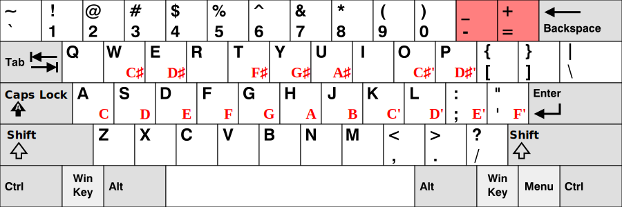

# Keyboard Shortcuts

The following keyboard shortcuts only works whilst **in an AudiTranscribe project**.


We will use **Ctrl** (Control) for shortcuts. On macOS, use **⌘** (Command) for shortcuts in place of Ctrl.


| Name                     | Description                                                                       | Shortcut |
|--------------------------|-----------------------------------------------------------------------------------|----------|
| Play/Pause Audio         | Toggle audio play/pause state.                                                    | Space    |
| Increase Audio Volume    | Increase the audio playback volume.                                               | Up       |
| Decrease Audio Volume    | Decrease the audio playback volume.                                               | Down     |
| Mute Audio               | 
Mutes the audio playback. Does <strong>not</strong> mute note playback.
 | M        |
| Seek 1 Second Before     | Seek 1 second before the current playback point.                                  | Left     |
| Seek 1 Second After      | Seek 1 second after the current playback point.                                   | Right    |
| Toggle Scroll            | Toggle scroll to playhead.                                                        | .        |
| Toggle Edit Mode         | Toggle note editing mode.                                                         | N        |
| Increase Playback Octave | Increase the playback octave by 1.                                                | =        |
| Decrease Playback Octave | Decrease the playback octave by 1.                                                | -        |
| Save Project             | Save the current project                                                          | Ctrl + S |

In addition, the following keys are used to play specific notes in the current playback octave.

<figure>
    
    <figcaption>
        
Key-to-Note Mapping for Windows

    </figcaption>
</figure>


The symbols $$C'$$, $$C♯'$$, $$D'$$ etc. are used to denote the key of the next octave.

For example, if the current octave is 5 (so $$C$$ means $$C_5$$), then $$C'$$ would refer to $$C_6$$, $$C♯'$$ would
refer to $$C♯_6$$, $$D'$$ would refer to $$D_6$$ and so on.
