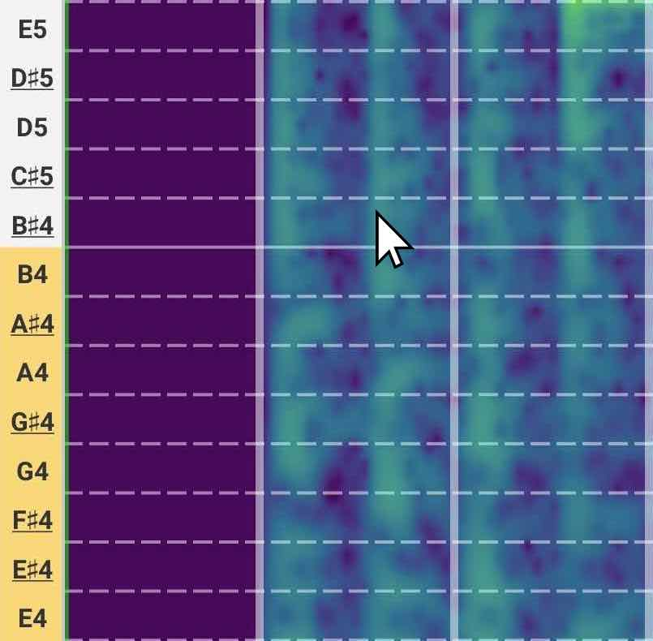
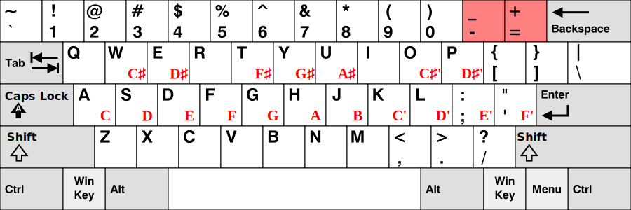
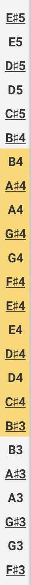

# Playing Notes

AudiTranscribe supports the option of playing specific notes. There are two main ways of playing notes:

- [With The Mouse](#playing-notes-with-the-mouse)
- [With The Keyboard](#playing-notes-with-the-keyboard)

## Playing Notes with the Mouse

To play a note, **click on the row of the note you want to play**. A sound at that frequency will be played.

<figure>
    
    <figcaption>
        
Click on the spectrogram to play a note

    </figcaption>
</figure>

In the above example, clicking on the row of $$B♯_4$$ (which is $$C_5$$ but in C♯ Major) will play the note of
$$B♯_4$$/$$C_5$$.

This is useful in providing a quick reference to what the frequency sounds.

## Playing Notes with the Keyboard

Playing notes with the keyboard has the advantage of allowing you to sustain the musical note that is being played.

The following keys are used to play specific notes in the current playback octave.

<figure>
    
    <figcaption>
        
Key-to-Note Mapping

    </figcaption>
</figure>


The symbols $$C'$$, $$C♯'$$, $$D'$$ etc. are used to denote the key of the next octave.

For example, if the current octave is 5 (so $$C$$ means $$C_5$$), then $$C'$$ would refer to $$C_6$$, $$C♯'$$ would
refer to $$C♯_6$$, $$D'$$ would refer to $$D_6$$ and so on.


To identify the current playback octave, look at the note bar on the side of the spectrogram. The notes highlighted
in **yellow** is in the current playback octave.

<figure>
    
    <figcaption>
        
Note Bar

    </figcaption>
</figure>

To adjust the current playback octave:

- Press the `-` key to **reduce** the current playback octave by 1 (e.g. from octave at $$C_5$$ to octave at $$C_4$$)
- Press the `=` key to **increase** the current playback octave by 1 (e.g. from octave at $$C_5$$ to octave at $$C_6$$)

Pressing the multiple keys on your keyboard to play multiple notes simultaneously.
