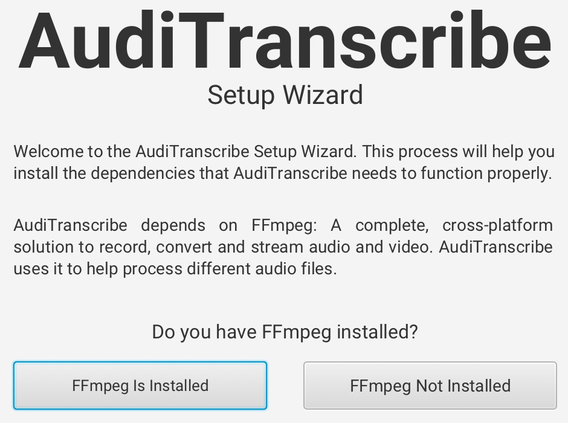
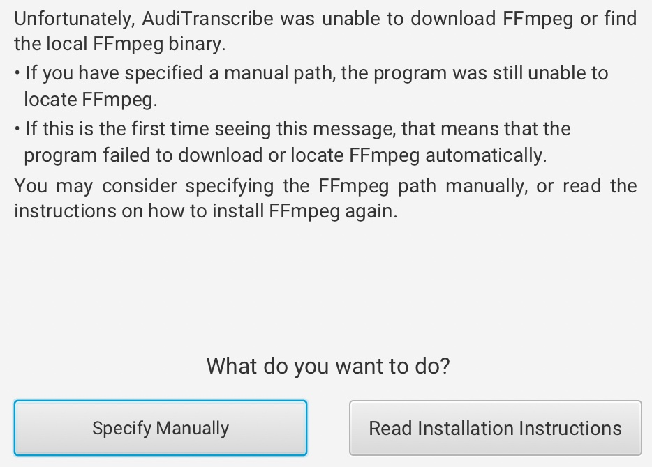
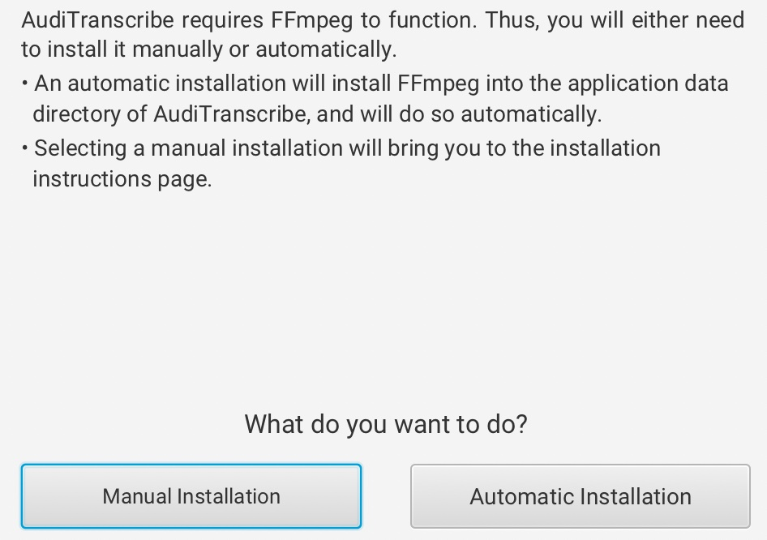
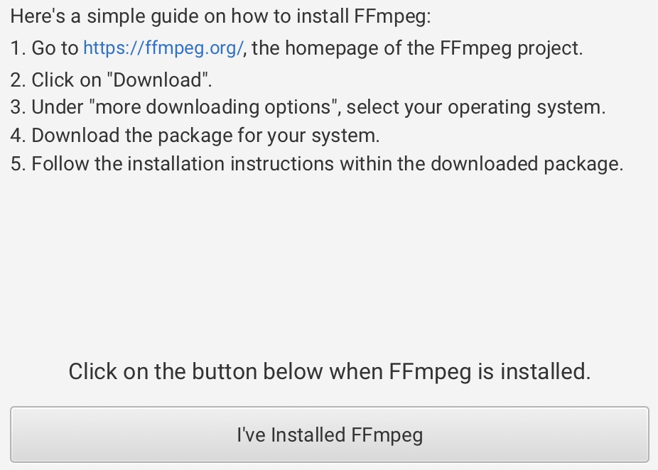
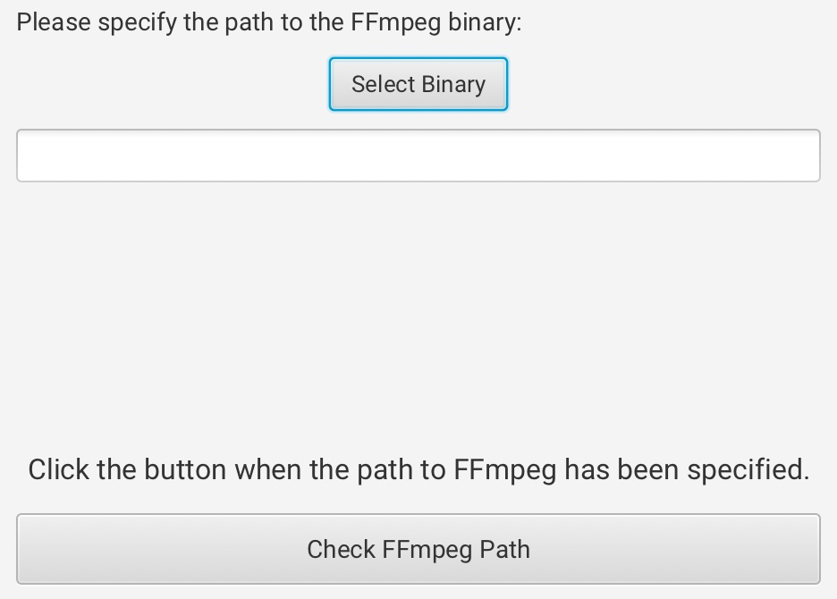
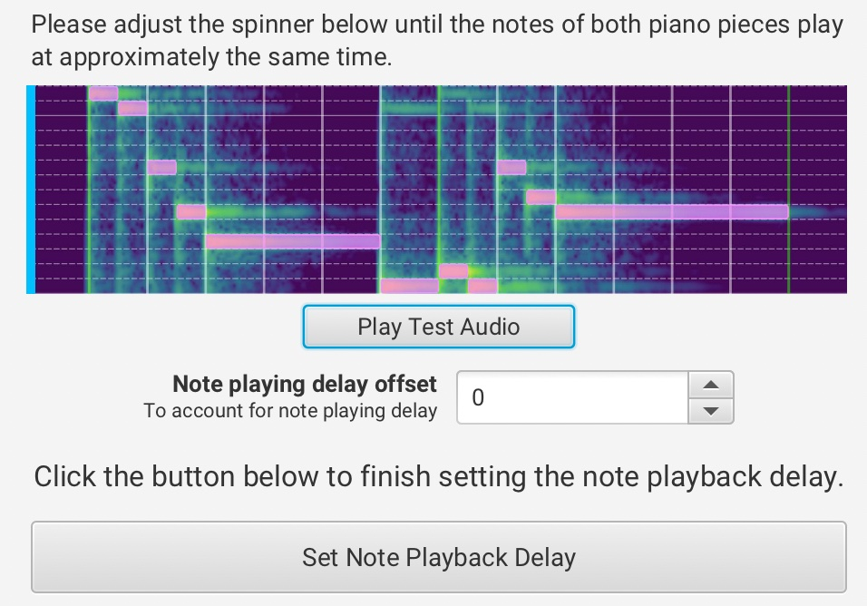

# Setup Wizard

This guide will go through the setup process of AudiTranscribe.

AudiTranscribe will show a setup wizard and install additional components in this step. The setup process may seem a
little complicated at first glance, but follow this guide, and you'll have it installed in no time!

Launch AudiTranscribe and let's begin!

## FFmpeg Installation Process

1. When AudiTranscribe is opened for the first time, a prompt will be shown, asking you whether FFmpeg is installed.\
   
    * If you have **already installed** FFmpeg (for example, by
      using [Homebrew](https://formulae.brew.sh/formula/ffmpeg) on macOS or Linux), click on the first button to let
      AudiTranscribe check whether the FFmpeg path is valid. Then,
        * if you **do not see any error**, proceed to **Step 6**.
        * if you **see an error**, proceed to **Step 2**.
    * If you **haven't already installed** FFmpeg, click on the second button. Then,
        * if you are on **Windows** or on **macOS**, proceed to **Step 3**;
        * otherwise, proceed to **Step 4**.
2. Failure to locate FFmpeg (either automatically or manually) will result in the following screen show up:\
   \
   You then have a choice to either **manually specify the path** or to **read the installation instructions**.
    * If you prefer to **manually specify the path**, proceed to **Step 5**.
    * Otherwise, proceed to **Step 4**.
3. AudiTranscribe now asks you whether to install FFmpeg automatically or manually.\
   
    * We recommend installing FFmpeg **automatically** as all the required setup processes will be handled by
      AudiTranscribe for you. **If you choose this option, please enable internet access**.
        * If the automatic installation **succeeds**, proceed to **Step 6**.
        * Otherwise, proceed to **Step 2**.
    * If you prefer a manual setup, click on the "Manual Installation" button and proceed to **Step 4**.
4. You will now be shown a series of instructions on how to **manually** install FFmpeg.\
   \
   Note that the installation instructions may have changed. Please refer to **your version of the installation
   instructions**.\
   Once you have installed FFmpeg, click on the "I've Installed FFmpeg" button.
    * If this installation step fails, you will be redirected to the "FFmpeg Not Found" screen. Refer to **Step 2**.
5. You may manually select the FFmpeg binary on this screen.\
   

    * Click on "Select Binary" to use your own operating system's file system to select the FFmpeg binary.
    * You can also manually specify the path to the FFmpeg binary by typing in the field below that button.

   Once you have entered the path to the FFmpeg binary (or selected it using the file system), click on "Check FFmpeg
   Path".

    * If the process succeeds, proceed to **Step 6**.
    * Otherwise, proceed to **Step 2**.
6. You have completed the FFmpeg installation process! Proceed on with the rest of the setup.

## The Rest of the Setup

1. The next step of the setup process is to fix possible note delay issues. **Enable internet access** and proceed.
2. An audio resource will be downloaded in order to help fix such issues.
3. Once the audio resource is downloaded, the following screen should appear:\
   \
   Click on the "Play Test Audio" button to begin the test. Adjust the value in the spinner below the button until both
   audio tracks play at around the same time.
4. You will be asked to set an update checking interval. This is the duration between subsequent checks for updates of
   the AudiTranscribe application, in **hours**.
5. You will then be asked to choose a theme for the application. Choose a theme and proceed.
6. You have reached the end of the setup process!

## Next Steps

Congratulations! You have completed the AudiTranscribe setup process. Proceed on with
the [Tutorial](../tutorial/0-overview.md) to start learning the basic functions of AudiTranscribe.
