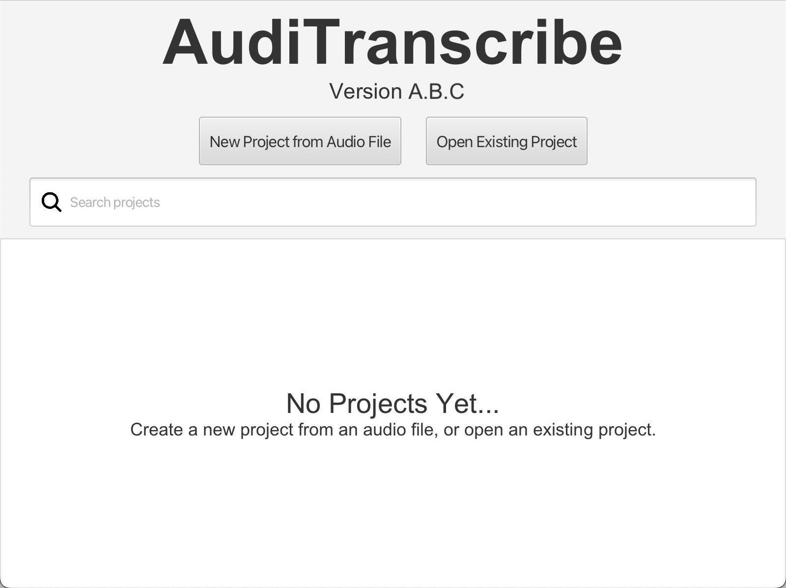
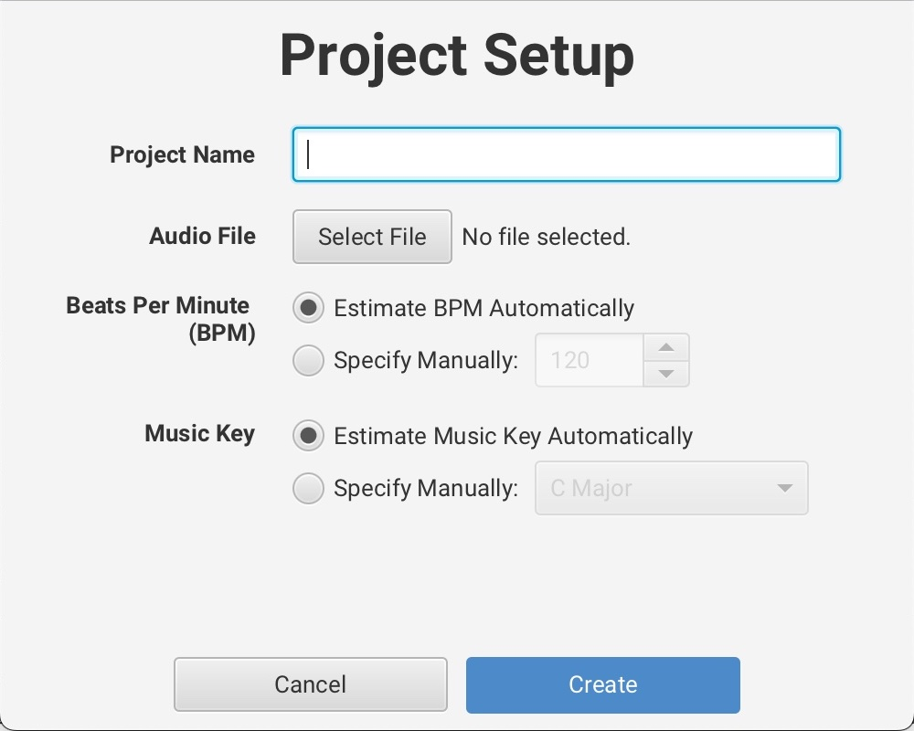
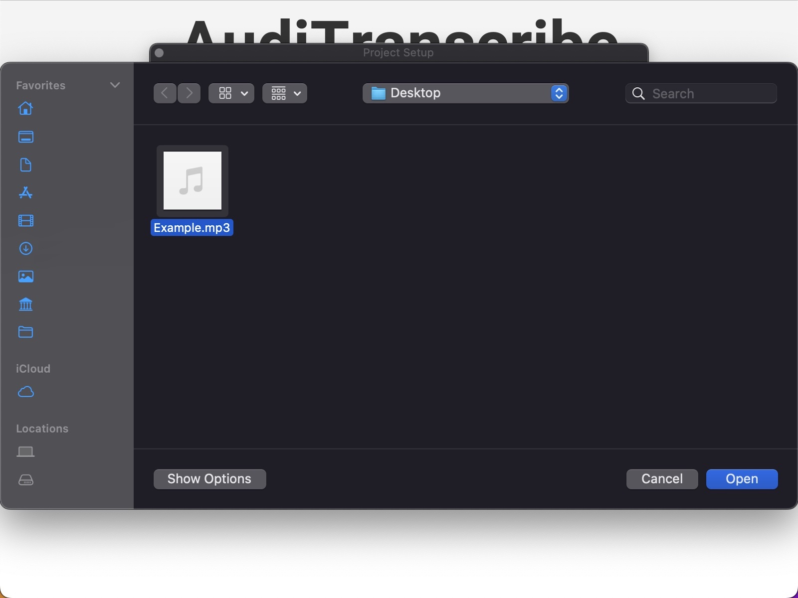
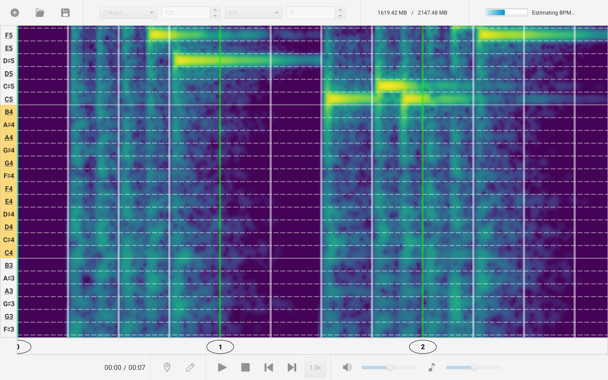

# 1. First Project

This page will guide you through setting up a new AudiTranscribe project.

Once the AudiTranscribe setup process is complete, AudiTranscribe will bring you to the main page. The main page should
show a list of projects.


If this is your first time, there will not be any projects that are shown.\



The following steps will guide you through how to create a transcription. You can use the following example file if you
do not have a file to try out the transcription.


An example file to use for transcription.


If you cannot download the file, you can use [this download link](misc/Example.mp3) instead.

1. Click on "New Project from Audio File".
2. AudiTranscribe will show a popup. This is the **project setup view**.\
   
3. Enter any name that you want for the project. We recommend the name `Example Project` for your first project.
4. For the audio file, click on "Select File". A popup will appear asking you to select a file.\
   \
   Navigate to your audio file (or the example audio file, which is named `Example.mp3`) and select it. The field for
   the audio file should automatically update with the path to the audio file.
5. Choose whether you want the Beats Per Minute (BPM) and the music key to be estimated automatically. For this example,
   we will **leave the settings as is**.
    * For your own projects, however, you may specify the BPM and music key manually.
6. Once you are comfortable with the settings, click on "Create".
7. The application will now attempt to generate a spectrogram for that audio file and estimate the required things.
   <figure>
      
      <figcaption>
         

            This is what the transcription view will look like while the spectrogram and estimation processes are still
            being performed.
         

      </figcaption>
   </figure>
   Wait for all processes to complete. You can tell that it is done when the progress bar in the top-right corner
   disappears.

Now you have a spectrogram! To save your progress, either:

* click on the **floppy disk icon** (:floppy\_disk:) near the **top-left corner** of the screen;
* save using the menu option of **File > Save** (or **File > Save As...**); or
* use the keyboard shortcut **Ctrl + S** (or **⌘ + S** on macOS).

Congratulations! You have just created your first AudiTranscribe file! Move on to
the [User Interface](2-user-interface.md) tutorial to learn how to understand the buttons on screen.
