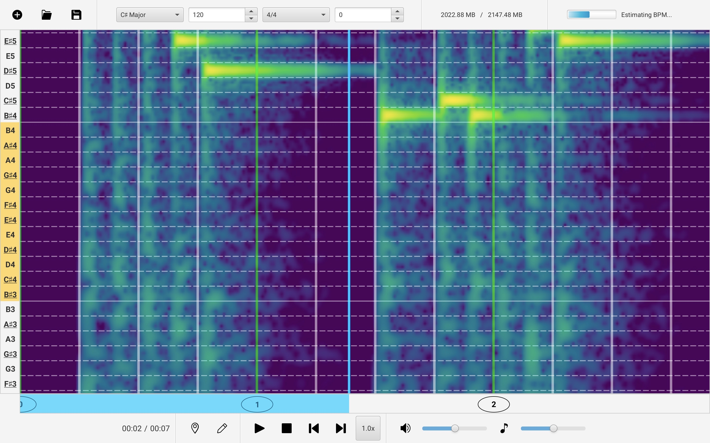
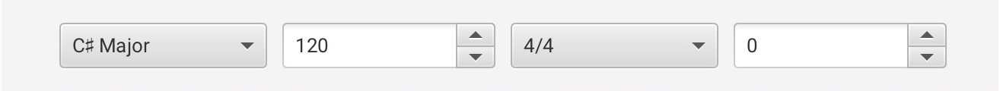
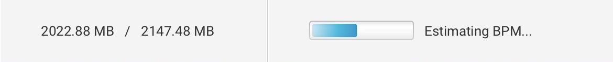
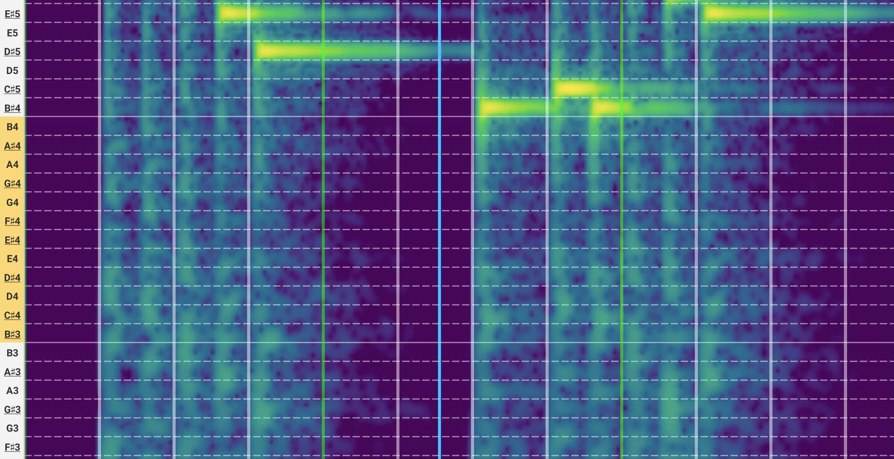
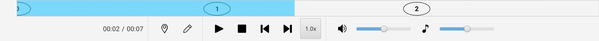
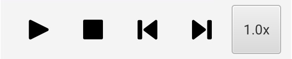
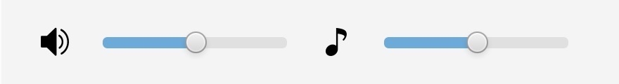

# 2. User Interface

This page will guide you through the user interface of AudiTranscribe.

<figure>
    
    <figcaption>
        
The full transcription view

    </figcaption>
</figure>

There are several parts to the user interface. We split the user interface into
the [top](2-user-interface.md#top-section), [spectrogram](2-user-interface.md#spectrogram-section),
and [bottom](2-user-interface.md#bottom-section) sections.

## Top Section

The top section of the user interface refers to the following part of the user interface.

<figure>
    
    <figcaption>
        
The top section

    </figcaption>
</figure>

The top section is divided into subsections. Learn about each of the subsections by selecting the corresponding tab.



<figure>
    
    <figcaption>
        
The left subsection

    </figcaption>
</figure>

The left subsection comprises options for saving and opening AudiTranscribe projects. We will explain the buttons from
left to right:

* The **save project button** allows you to select a place to save the project. The project will be saved as an `.audt`
  file.
* The **new project button** allows you to create a new project based on another audio file. AudiTranscribe would prompt
  you to save your current project if you click this button.
* The **open project** button opens an existing AudiTranscribe project.
    * AudiTranscribe would prompt you to save your current project if you click this button.
    * You must save the existing project in a file with the extension of .audt.




<figure>
    
    <figcaption>
        
The middle subsection

    </figcaption>
</figure>

The middle subsection comprises options to change the current project's music settings.

* The first dropdown allows you to select the **music key**.
    * Some example music keys are "C Major", "D♯ Minor", and "B♭ Minor".
* The next field allows you to specify the **beats per minute (BPM)**.
    * Note that the definition of a _beat_ will change depending on the time signature. For example, a BPM of 120 for
      the time signature "6/8" means that 120 eighth notes will be played.
* The following dropdown allows you to select the **time signature** of the piece.
    * Some example time signatures are "4/4", "6/8", "3/4".
* The final field allows you to specify the **audio offset** in seconds.
    * The audio offset refers to the number of seconds before the music starts playing.
    * You can set the audio offset to be a negative number.




<figure>
    
    <figcaption>
        
The right subsection

    </figcaption>
</figure>

The right subsection contains the memory usage and (sometimes) a progress bar.

* The memory usage shows how much memory is being used by the program.
* The progress bar shows the progress of the current task.




## Spectrogram Section

The spectrogram section refers to the following part of the user interface.

<figure>
    
    <figcaption>
        
The spectrogram section

    </figcaption>
</figure>

* The left side of the spectrogram section shows notes. Each row of the spectrogram corresponds to a specific musical
  note.
    * Changing the music key will change the _form_ of the notes shown. For example, $$C♯$$ in C Major may show up as
      $$D♭$$ in C♭ Major.
    * Underlined notes are **notes that are in the current scale**. Non-underlined notes are not in the current scale.
* The right side shows a spectrogram, which shows which frequencies are the loudest. The most audible frequencies are
  displayed as the brightest on the spectrogram.
    * Note that harmonics (notes with frequencies that are multiples of the fundamental frequency) will show up as
      slightly fainter lines.
* A blue line can be seen on the spectrogram. This is the **playhead**, and shows where you are in the audio.
    * You can adjust the playhead by clicking on the progress meter on the bottom of the view. See
      the [bottom section](2-user-interface.md#bottom-section).

A helpful thing you can do is **click on the row of the note you want to play**. A sound at that frequency will be
played. This is useful in providing a quick reference to what the frequency sounds.

* Note that this only works if you are not in edit mode (see below).

Learn more about playing notes in the [Playing Notes](../reference/playing-notes.md) chapter of the tutorial.

## Bottom Section

The bottom section refers to the following part of the user interface.

<figure>
    
    <figcaption>
        
The bottom section

    </figcaption>
</figure>

Right at the top of the bottom section is the **progress meter**. This is the blue bar that is shown. This indicates
where you currently are at in the audio file. To adjust your current position, simply **click on where you want to seek
to**. The blue bar and the playhead will move accordingly.

The bottom-most part of the transcription view is also separated into subsections. Learn about each of the subsections
by selecting the corresponding tab.



<figure>
    
    <figcaption>
        
The left subsection

    </figcaption>
</figure>

* The leftmost things you will see is the progress into the audio, in minutes and seconds.
* The _map marker_ button is the **scroll to playhead button**. Toggle it to automatically scroll along the spectrogram
  as the audio is playing.
* The _pencil_ button is the **edit mode button**. This button allows you to toggle between **playback mode** and
  **editing mode**.
    * Playback mode is primarily for listening to the audio and seeing the spectrogram. **Note editing is disabled in
      this mode**.
    * Editing mode allows you to place and delete notes on the spectrogram. For more, see
      the [Creating Notes](../reference/creating-and-editing-notes.md) chapter of the tutorial.
        * You may still play the audio in edit mode, but you will not be able to click on the row of the note to play
          the corresponding note.




<figure>
    
    <figcaption>
        
The middle subsection

    </figcaption>
</figure>

The middle subsection comprises options to navigate the audio.

* The first button is the **play/pause button**.
* The second button is the **stop button**. Press it to stop the audio and return to the beginning.
* The third button is the **skip backwards button**. Press it to return to the start of the audio track.
* The fourth button is the **skip forwards button**. Press it to go to the end of the audio track.
* The fifth button is the **toggle slowdown button**.
    * Press the button once to play a slowed-down version of the audio. This is meant to help you to better catch finer
      music details.
    * The slowed-down audio is not pitch shifted. This means that whatever you hear in the slowed audio is the same
      pitch as that of the original audio.
    * Press the button again to return to normal speed.




<figure>
    
    <figcaption>
        
The right subsection

    </figcaption>
</figure>

The right subsection contains volume adjustments.

* The first set of volume adjustment is for the **audio playback**. This is the volume of the audio that will be played
  as you transcribe.
* The second set of volume adjustment is for the **notes' playback**. After notes are placed, this slider and button
  controls the volume of the notes that may be played.




Now that you understand how the user interface works, you can [Start Transcribing](3-beginning-to-transcribe.md) the
example audio file.
