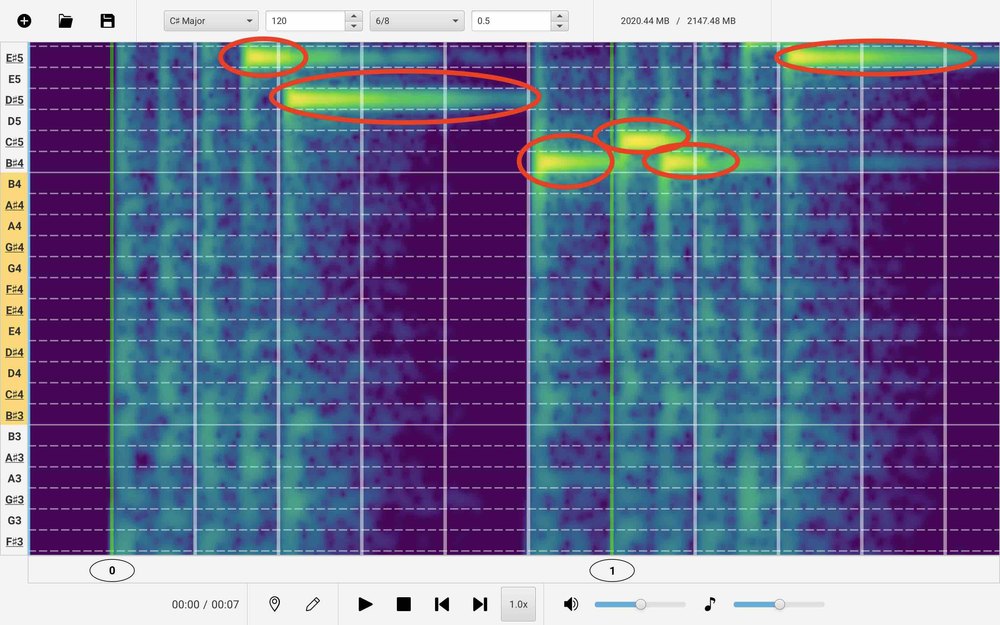

# 3. Beginning to Transcribe

AudiTranscribe is built to assist you with transcribing audio pieces. This walkthrough will guide you through the
process of transcribing an audio file.



* This page assumes familiarity with the [user interface](2-user-interface.md).
* We will use the example project created in the [first chapter](1-first-project.md) of the tutorial.



Adjusting Project Settings

We will first need to adjust the music key, BPM, time signature, and playback offset.

If you are using the example project file, and enabled estimation of both the BPM and the music key, the top section of
the UI should show the following information:

* **Music Key**: F Major
* **BPM**: 120.2
* **Time Signature**: 4/4
* **Offset**: 0

Unfortunately, although the music key and BPM are close to the actual values, these are not the correct settings for the
project. Adjust the settings so that they have the following values:

* **Music Key**: C♯ Major
* **BPM**: 120
* **Time Signature**: 6/8
* **Offset**: 0.5

Once you have updated the settings, **save the project**.

Hearing How the Audio Sounds

Once the project settings are correct, we would like to hear how the audio sounds. There are two ways to do this:

1. Press the **play/pause button** at the bottom of the window.
2. Press the **space bar**.

To stop playing the audio file, press the pause/play button again or press the space bar.

Basics of Navigation

To move around the spectrogram, you can do one of a few things.

* To scroll up or down, use the **scroll** **wheel** to scroll up or down.
* To move left or right, drag the spectrogram by clicking and dragging on the spectrogram.
* Alternatively, you can use the **scroll to playhead button** to help you move along the spectrogram.
    * However, this is not recommended as it is very jerky.

Transcribing

Now that we have a good idea of how the music sounds, let's try and transcribe it by hand.

1. Enable **editing mode**. You can do this by either
    * pressing the **edit mode button** at the bottom of the window, or
    * pressing the **N** key on your keyboard.
2. Find a spot where the audio intensity is high.
    * The higher the audio intensity, the brighter the colour of the spectrogram. Some spots that are high intensity are
      shown in the image below.
      <figure>
         
         <figcaption>
            
Some high intensity spots on the spectrogram

         </figcaption>
      </figure>
    * To determine if a note at that pitch is playing at that time, **disable note editing** mode before clicking on the
      spectrogram to hear how that note would sound. **Remember to re-enable note editing before continuing!**
3. At that spot, click on the spectrogram. A pink rectangle should appear.
    * If you hear a note playing instead of seeing a pink rectangle created, enable note editing mode first by following
      Step 1.
4. Resize the note to the desired size. You can do this by dragging the sides of the note rectangle.
5. To play the transcribed notes along with the audio, play the audio.
    * To mute the original audio playback, click on the mute audio button.
    * To mute the notes' playback, click on the mute notes button.
6. Repeat steps 2 to 5 until you have transcribed the audio sufficiently.

At this point, you should have an audio file with transcribed notes.

Congratulations! You have transcribed an audio file! Don't forget to save the project before continuing on with
the [exporting process](4-exporting.md).


Learn more about [creating, editing](../reference/creating-and-editing-notes.md)
and [playing](../reference/playing-notes.md) notes in the reference.

